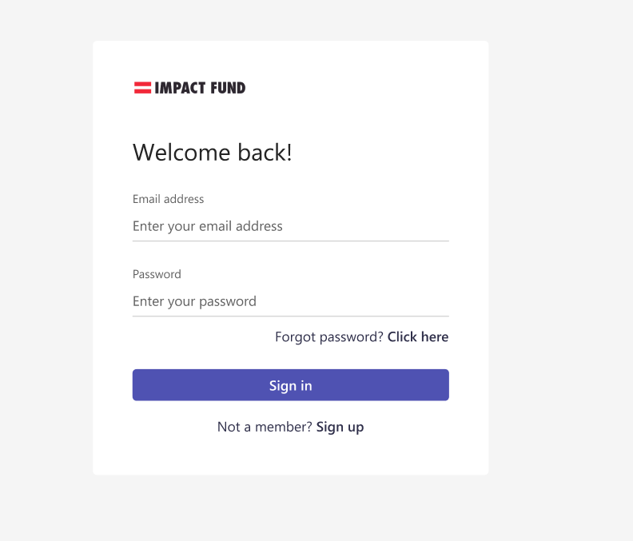
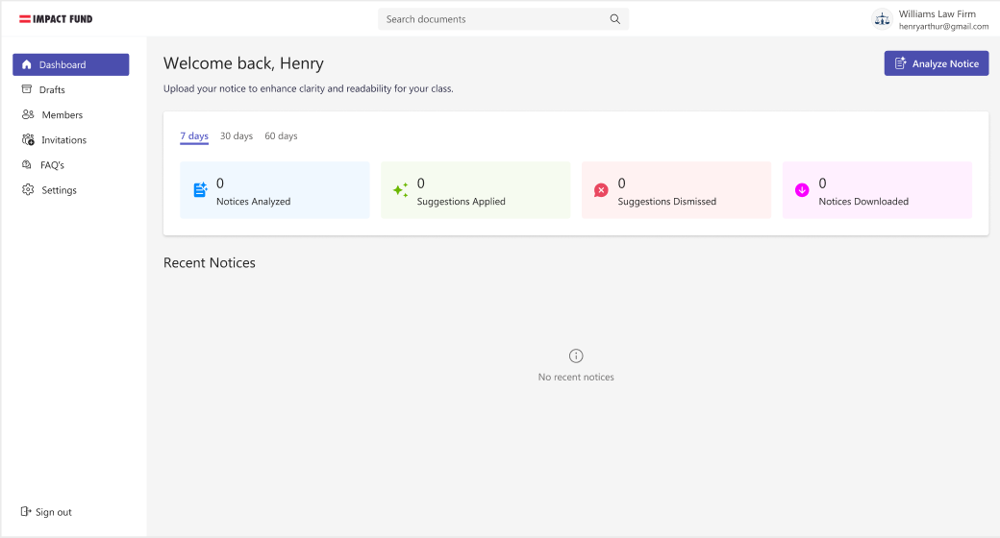
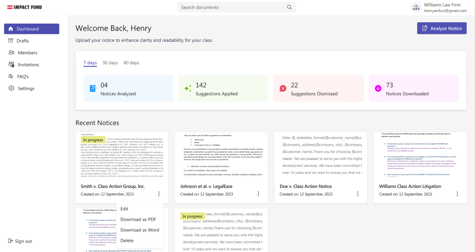
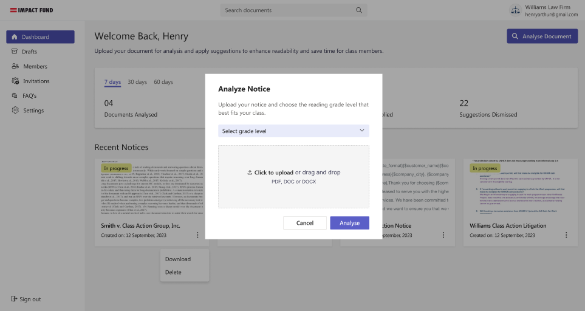
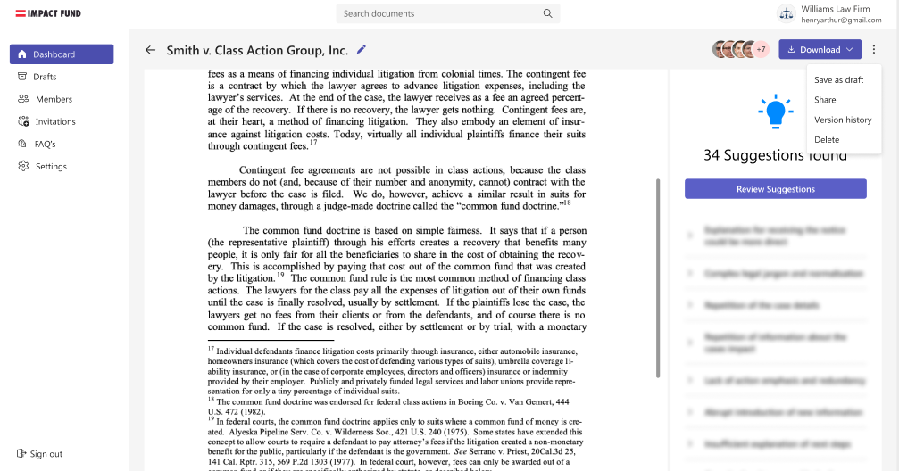
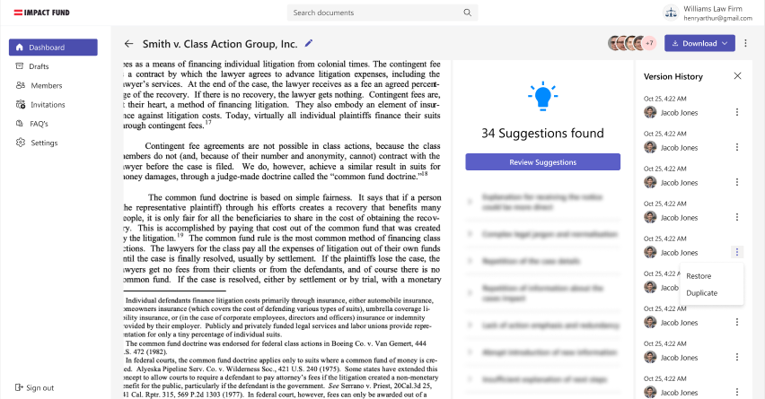
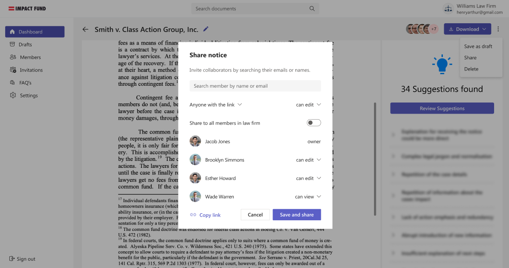
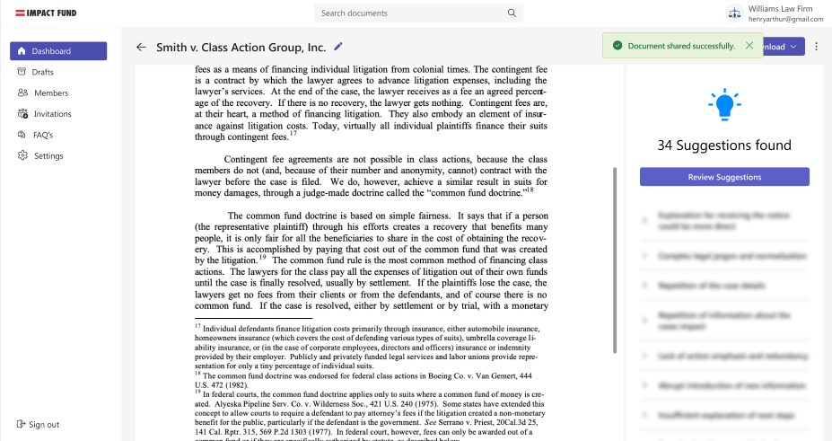
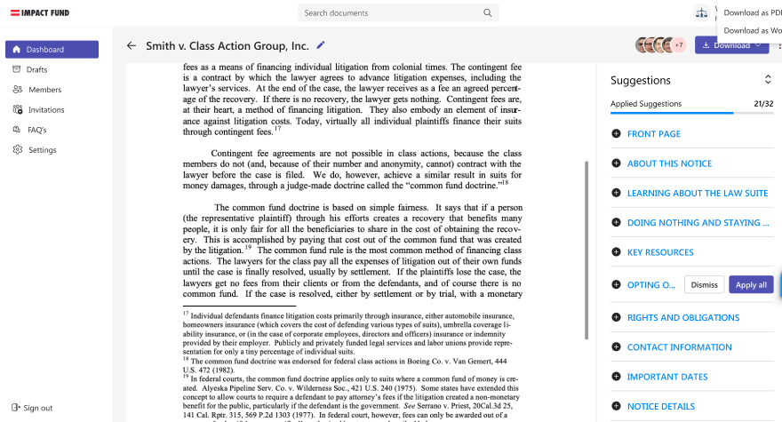

# 🧠 Legal Document Enhancer – Web App & Microsoft Word Add-in

An AI-powered platform tailored for **law firms and legal professionals** to simplify, format, and ensure the legal integrity of complex documents. With real-time suggestions, feedback, and seamless Microsoft Word integration, this tool transforms how legal documents are edited and reviewed.

---

## 🚀 Features

- ✅ AI-Powered Document Suggestions (OpenAI integrated)
- 📄 Enhanced Document Readability
- 🔐 Legal Accuracy Validation
- 🧩 Microsoft Word Add-in Support
- 💬 Inline Feedback & Comments
- 🎯 One-click Formatting Tools

---

## 📸 UI Screenshots

### Web App & Add-in Preview

<p float="left">
  
  
  
  
  
  
  
  
  
  
</p>

---

## 🛠️ Tech Stack

- **Frontend**: React / Next.js / TailwindCSS
- **Backend**: Node.js / Express
- **AI**: OpenAI API
- **Add-in**: Office.js (Microsoft Word Add-in)

---

## ⚙️ Getting Started

### 📦 Prerequisites

- Node.js (v16+)
- npm / yarn
- Microsoft Word (Office 365 recommended)
- [Office Add-in Developer Tools](https://learn.microsoft.com/en-us/office/dev/add-ins/)

---

### 🖥️ Web App Setup

```bash
git clone https://github.com/your-username/legal-docs-ai-assistant.git
cd legal-docs-ai-assistant
npm install
npm run dev
```

> Visit `http://localhost:3000` to view the app.

---

### 🧩 Microsoft Word Add-in Setup

1. Open Microsoft Word
2. Sideload the Add-in:
   - Go to **Insert > Add-ins > My Add-ins > Upload My Add-in**
   - Select the `manifest.xml` from the repo
3. Use the sidebar to interact with the document via AI

📘 [How to sideload Office Add-ins](https://learn.microsoft.com/en-us/office/dev/add-ins/testing/sideload-office-add-ins-for-testing)

---

## 📁 Folder Structure

```bash
.
├── public/
│   └── screenshots/
├── src/
│   ├── components/
│   ├── pages/
│   └── utils/
├── add-in/
│   └── manifest.xml
└── README.md
```

## 📄 License

[MIT](./LICENSE)

---
